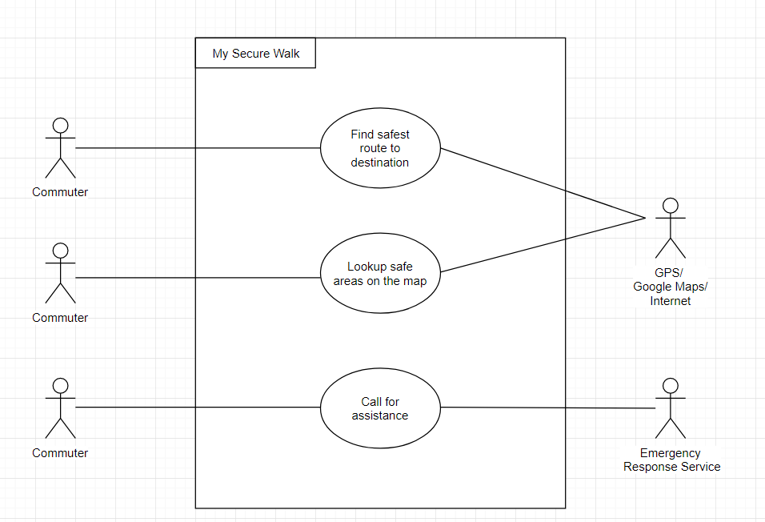

# Walk-Mate

## Project Abstract

Exiting apps on the Google Play Store only display the shortest way to reach a destination. They fail at providing the safest way to the destination. That is where My Secure Walk comes into play. The app requires users to type in their destination and maps out a route that is relatively safer than others.

This application is targeted at commuters who live in potentially less safe areas and may want to avoid areas with high crime rate. 

UML Use Case Diagram

## Project Relevance

My Secure Walk is an android application that would require heavy use of Java and Object Oriented Design Principles to function properly. The application will be built in Android Studio and will make use of the Google Maps API. Further, it would use a crime alert database or API to monitor crime rates in each neighbourhood within the vicinity and would update the user of threats and things to be watchful of. Additional functionality would include a panic option which alerts the Emergency Response Service of an Emergency at your current location.

The application would make use of suitable GUI design principles to aid user navigability and usage. We would also perform alpha testing on the application to make sure it functions correctly.

## Conceptual Design

My contribution to the project would be the programming and the implementation of the Google Maps API, the data acquisition either using an existing database or an API and the overall design and layout of the User Interface of the application. If time permits, we might possibly be able to run machine learning algorithms that would predict the safety of a given route based on the existing data.

## Link

https://github.com/3296-02-f19temple/individual-subject-proposal-ahmadsaad007.git

## Required Resources

Hardware: Android device, Personal Computers with the following Software installed

Software: Android Studio

